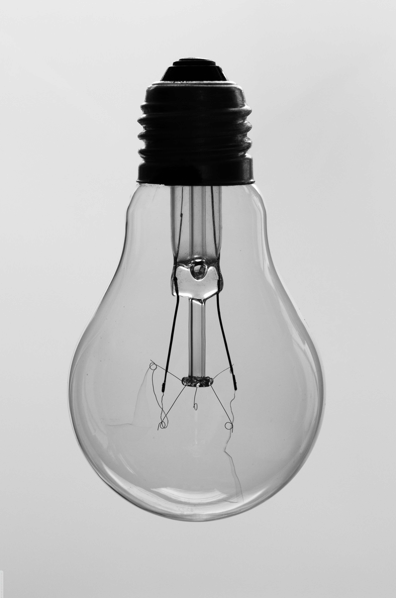
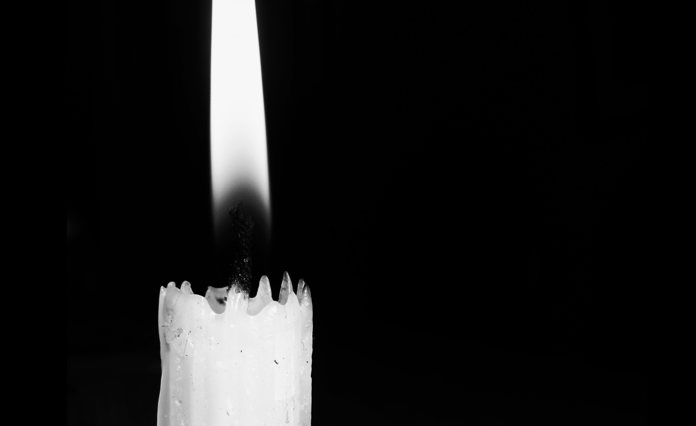
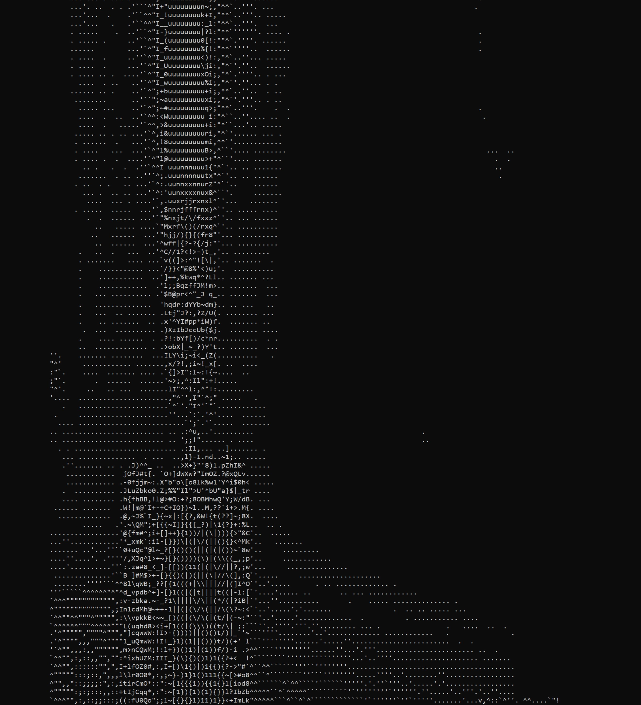
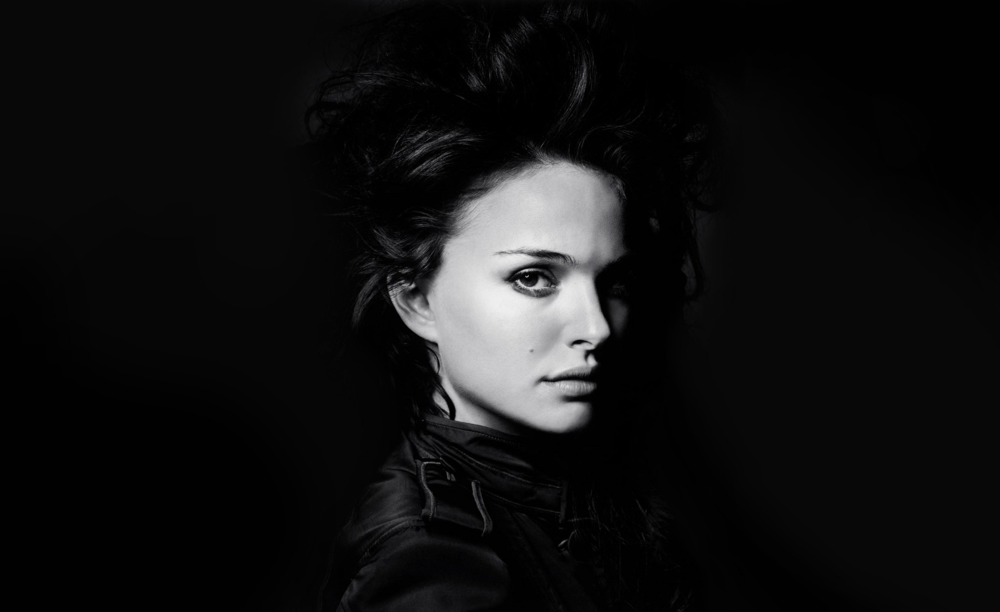
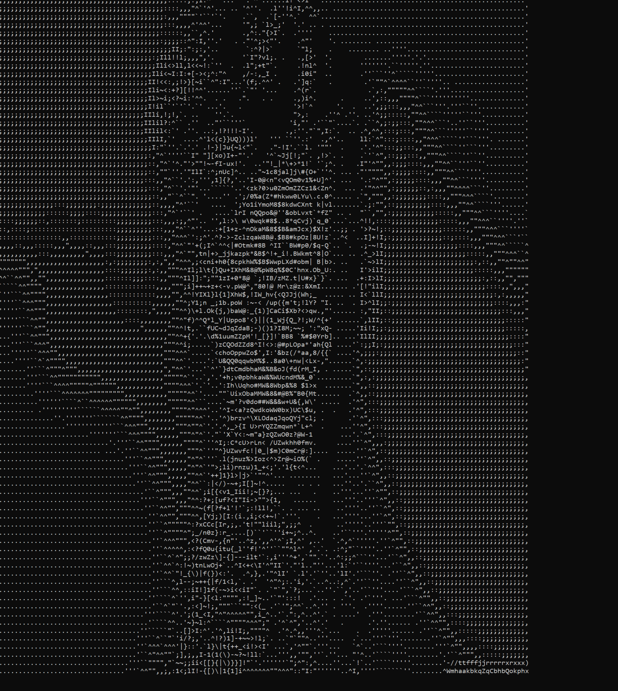
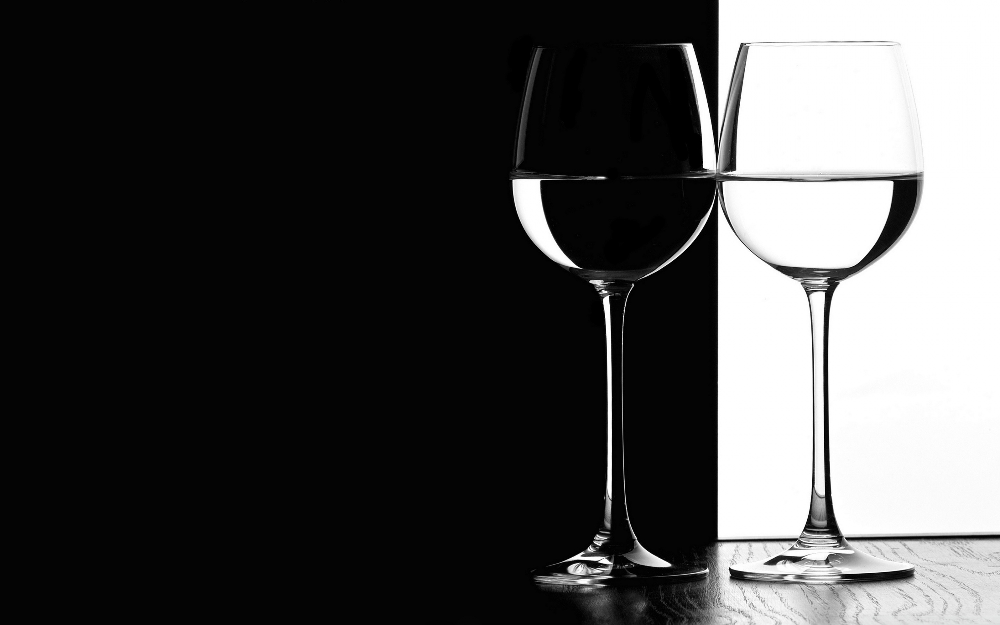

# ___`A minimal ASCII art generator`___

---------------
### ___Prints out the ASCII image of a `Windows BMP` image file___
-------------

#### ___Examples___

 
 

 
 

 
 

 
 

 
 

### ___Caveats___
-----------------
- Doesn't support any other image formats.
- `Win32` oriented, portability is a non-goal.
- Most routines are implemented as inline functions in the headers.
- Images (ASCII arts) often end up a little distorted, in particular, they tend to become narrow and tall compared to the original `.BMP` image.
- Not particularly good at capturing specific details in images, especially if those details are represented by minute differences in colour gradients (this specificity gets lost in the black and white transformation and downscaling)
- The outputs shown in the `README` aren't very representative, best samples are chosen for showcasing, some images turn our without any semblance to the original image!
