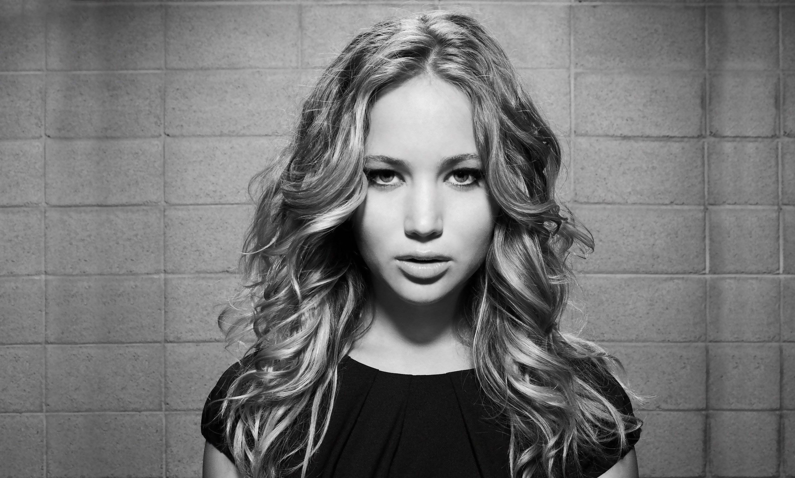
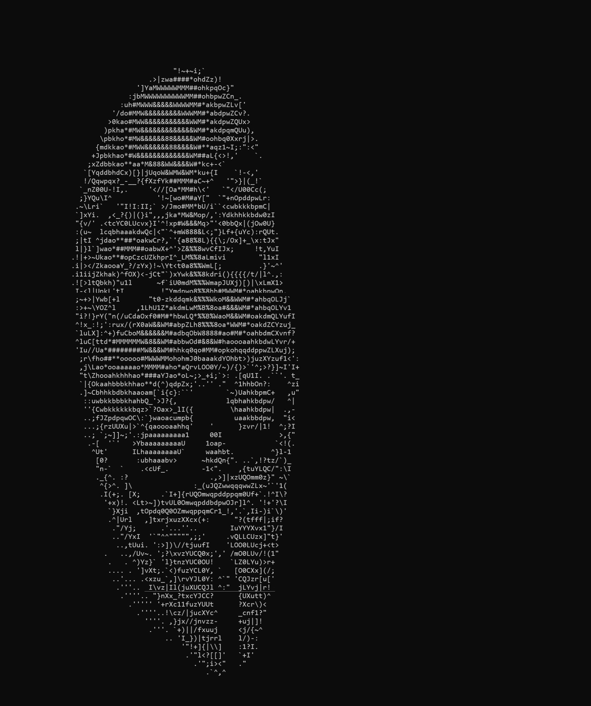
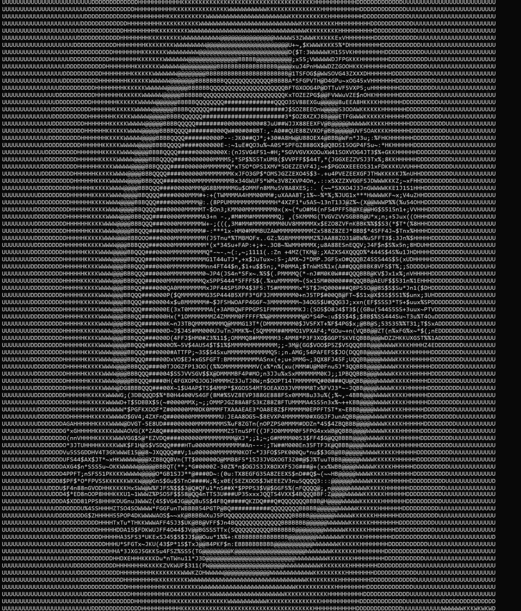

## ___Windows BMP images to ASCII strings___
--------------

_Examples in the README use JPEG version of the bitmaps because BMPs take up too much space!_

Three ascii palettes are available in `<utilities.h>` to choose the characters from. These are arrays of wide ascii characters ordered in increasing luminance:
```C
static const wchar_t palette_minimal[]  = { ... };
static const wchar_t palette[]          = { ... };
static const wchar_t palette_extended[] = { ... };
```

For the RGB to ascii conversion, a string of mappers are available in `<utilities.h>`:

```C
// uses the arithmetic average of the red, green and blue values of the pixel to determine which 
// wide character to map
static inline wchar_t __stdcall arithmetic_mapper(
    _In_ const register RGBQUAD* const restrict pixel,
    _In_ const register wchar_t* const restrict palette,
    _In_ const register unsigned plength
);

// uses a predetermined set of weights for red, green and blue values of the pixel to determine 
// the wide character
static inline wchar_t __stdcall weighted_mapper(...);

// uses the average of the minimum and maximum amongst the red, green and blue values of the 
// pixel to determine the wide character
static inline wchar_t __stdcall minmax_mapper(...);

// uses a predetermined set of weights (different from the weights used by weighted_mapper) for
// red, green and blue values of the pixel to determine the wide character
static inline wchar_t __stdcall luminosity_mapper(...);
```

```C
// allows customization of the weights that were predetermined in the weighted and luminosity
// mappers
static inline wchar_t __stdcall tunable_mapper(
    _In_ const register RGBQUAD* const restrict pixel,
    _In_ const register float bscale, // scaling factor for blue
    _In_ const register float gscale, // scaling factor for green
    _In_ const register float rscale, // scaling factor for red
    _In_ const wchar_t* const restrict palette,
    _In_ const unsigned plength
);
```

There are also an array of penalizing transformers in `<utilities.h>` that facilitate penaliztion of character mapping when pixels meet a specified criteria:

```C
// this mapper will penalize the result of the mapper by the specified penalty value
// when the pixel's RGB values all fall within the ranges specified by the <>llim (lower limit)
// and <>ulim (upper limit) delimiters.
static __forceinline wchar_t __stdcall penalizing_arithmeticmapper(
    _In_ const register RGBQUAD* const restrict pixel,
    _In_ const register uint8_t bllim, // lower limit for blue
    _In_ const register uint8_t bulim, // upper limit for blue
    _In_ const register uint8_t gllim,
    _In_ const register uint8_t gulim,
    _In_ const register uint8_t rllim,
    _In_ const register uint8_t rulim,
    _In_ const wchar_t* const restrict palette,
    _In_ const register unsigned plength,
    _In_ const register float    penalty
);

static inline wchar_t __stdcall penalizing_weightedmapper(...);
static inline wchar_t __stdcall penalizing_minmaxmapper(...);
static inline wchar_t __stdcall penalizing_luminositymapper(...);
```

------

<div> </div>
<div> </div>
<div> </div>
<div> </div>
<div> </div>

### ___Caveats___
-----------------

- Doesn't support any other image formats.
- Only supports bitmaps with bottom-up scanline ordering (majority of the bitmaps in contemporary use are of this type). Bitmaps with top-down scanline order will result in a runtime error.
- Owing to the liberal reliance on `Win32` API, will not compile on UNIX systems without substantial effort.
- Not particularly good at capturing specific details in images, especially if the images are large and those details are represented by granular differences in colour gradients (this specificity gets lost in the black and white transformation and downscaling)
- Best results with colour images are obtained when there's a stark contrast between the object of interest and the background (even with a penalizing mapper).
- Monospaced typefaces are critical to get decent renders, non-monospaced typefaces will probably make the patterns incoherent and indistinguishable!
- The distortion in the image dimension during ascii mapping comes from the inherent non-square shaped nature of most typefaces.
Even with monospaced typefaces, characters are taller than they are wide!. This unfortunately makes the ascii representations seem vertically stretched :(   

___For a comprehensive explanation of the implementation, browse the source code, it is thoroughly annotated!.___
